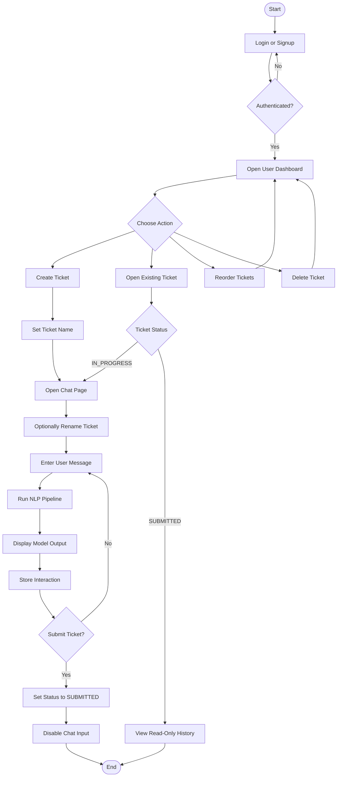
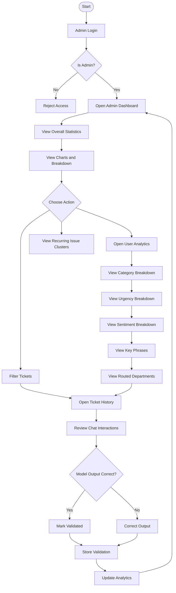

# Activity Diagrams

## Customer Activity

```mermaid
flowchart TD
    A([Start]) --> B[Login or Signup]
    B --> C{Authenticated?}
    C -->|No| B
    C -->|Yes| D[Open User Dashboard]
    D --> E{Choose Action}
    E --> F[Create Ticket]
    E --> G[Open Existing Ticket]
    E --> H[Reorder Tickets]
    E --> I[Delete Ticket]
    F --> J[Set Ticket Name]
    J --> K[Open Chat Page]
    G --> L{Ticket Status}
    L -->|IN_PROGRESS| K
    L -->|SUBMITTED| M[View Read-Only History]
    K --> N[Optionally Rename Ticket]
    N --> O[Enter User Message]
    O --> P[Run NLP Pipeline]
    P --> Q[Display Model Output]
    Q --> R[Store Interaction]
    R --> S{Submit Ticket?}
    S -->|No| O
    S -->|Yes| T[Set Status to SUBMITTED]
    T --> U[Disable Chat Input]
    M --> V([End])
    U --> V
    H --> D
    I --> D
```

## Admin Activity

```mermaid
flowchart TD
    A([Start]) --> B[Admin Login]
    B --> C{Is Admin?}
    C -->|No| D[Reject Access]
    C -->|Yes| E[Open Admin Dashboard]
    E --> F[View Overall Statistics]
    F --> G[View Charts and Breakdown]
    G --> H{Choose Action}
    H --> I[Filter Tickets]
    H --> J[Open User Analytics]
    H --> K[View Recurring Issue Clusters]
    J --> L[View Category Breakdown]
    L --> M[View Urgency Breakdown]
    M --> N[View Sentiment Breakdown]
    N --> O[View Key Phrases]
    O --> P[View Routed Departments]
    I --> Q[Open Ticket History]
    P --> Q
    Q --> R[Review Chat Interactions]
    R --> S{Model Output Correct?}
    S -->|Yes| T[Mark Validated]
    S -->|No| U[Correct Output]
    T --> V[Store Validation]
    U --> V
    V --> W[Update Analytics]
    W --> E
```
