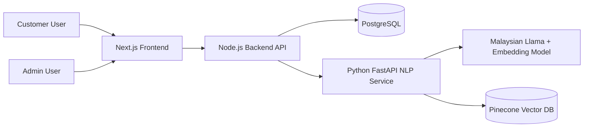
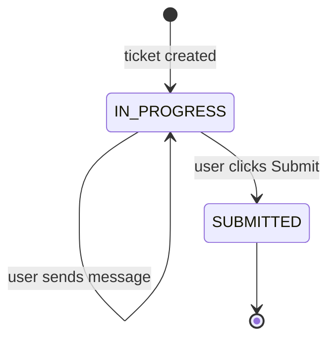

# System Architecture

## Context

The system solves the problem of manual and inaccurate customer feedback routing. It provides two dashboards:

1. Customer dashboard for creating and managing ticket conversations.
2. Admin dashboard for monitoring ticket statistics, reviewing chat histories and validating model outputs.

## High-Level Architecture



## Main Components

### Frontend

The frontend is a Next.js application with:

- Login page
- Signup page
- Customer dashboard
- Customer ticket chat page
- Admin dashboard
- Admin user analytics page

### Backend

The backend is a Node.js Express application with modular route handlers:

- Authentication module
- Customer ticket module
- Admin analytics module
- NLP client module

The backend is responsible for:

- Password hashing
- JWT authentication
- Role-based access control
- Ticket ownership checks
- Database transactions
- Calling the NLP service
- Storing all interactions and model outputs
- Serving analytics to the admin dashboard

### NLP Service

The NLP service is a Python FastAPI application responsible for:

- Category classification
- Urgency detection
- Sentiment analysis
- Key phrase extraction
- Department routing
- Embedding generation
- Pinecone upsert and similarity search

The service supports three modes:

- `demo`: deterministic heuristic outputs for quick testing
- `llama` / `malaysian-llama`: prompt-based structured inference using `mesolitica/Malaysian-Llama-3.2-3B-Instruct`
- `sequence-classifier`: optional legacy/future supervised HuggingFace classifiers

### PostgreSQL

PostgreSQL stores:

- Users
- Tickets
- Ticket interactions
- Model outputs
- Admin validation records
- Vector references

### Pinecone

Pinecone stores vector embeddings and metadata for semantic similarity search.

The recommended embedding model is BGE-M3 with:

```text
dimension = 1024
metric = cosine
```

## Ticket Lifecycle



Rules:

- A ticket starts as `IN_PROGRESS`.
- Users may send messages only while the ticket is `IN_PROGRESS`.
- A ticket becomes `SUBMITTED` when the user clicks Submit.
- Submitted tickets are read-only for chat messages.
- Ticket names remain editable after submission.

## Model Output Schema

Each interaction stores model output as structured JSON:

```json
{
  "category": "Payment Issue",
  "urgency": "High",
  "urgency_colour": "Red",
  "sentiment": "Negative",
  "key_phrases": ["charged twice", "refund"],
  "department": "Finance Department",
  "confidence": {
    "category": 0.88,
    "urgency": 0.82,
    "sentiment": 0.91
  },
  "similar_tickets": []
}
```

## Design Justification

### Modular monolith + NLP service

This architecture avoids unnecessary microservice complexity while still separating the Python NLP workload from the Node.js business API.

### Human-in-the-loop validation

Admin corrections are stored separately from original model outputs. This preserves auditability and allows future model evaluation.

### Pinecone used only for vector search

PostgreSQL remains the source of truth. Pinecone stores embeddings and metadata for semantic similarity only.

### Malaysian Llama as structured classifier

The runtime classifier now uses `mesolitica/Malaysian-Llama-3.2-3B-Instruct` in `NLP_MODE=llama`. Since the model is an instruction-tuned causal language model rather than a classification head, the service constrains it through a strict JSON prompt. The backend therefore receives the same stable fields: category, urgency, sentiment, key phrases and department.

### Department routing as business logic

Departments are derived from predicted categories using a mapping table. This is easier to maintain than training a separate department classifier.
