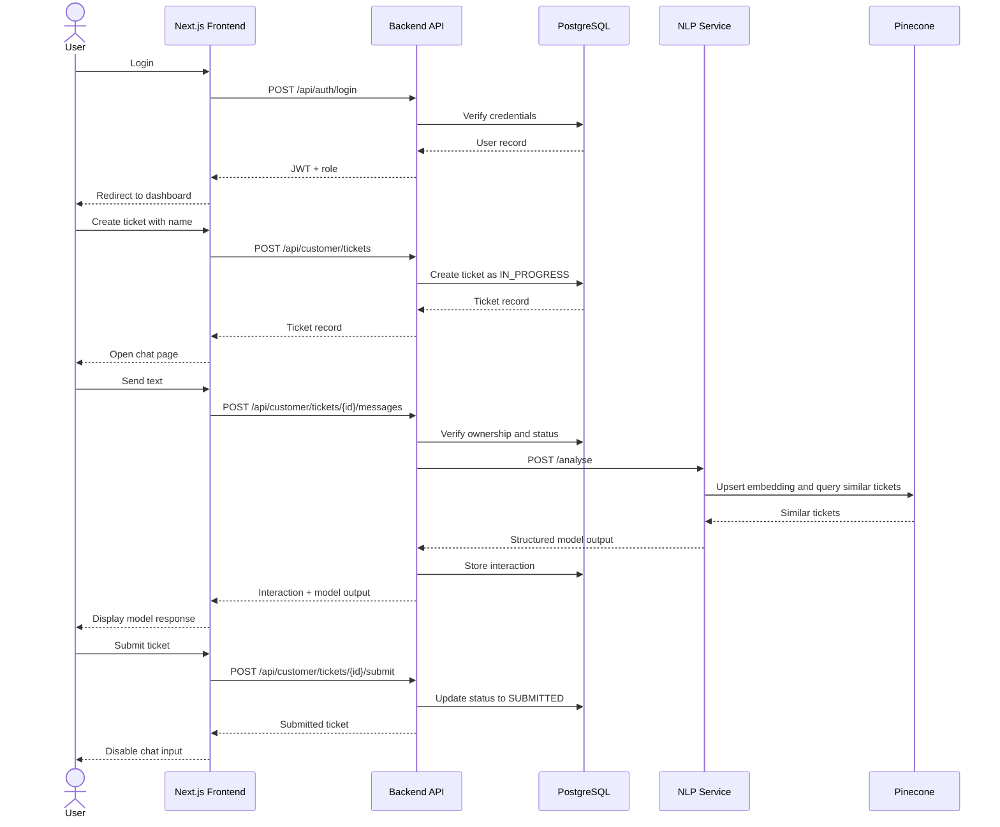
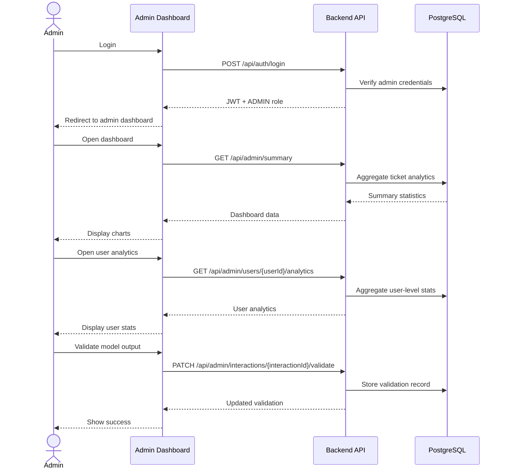

# Sequence Diagrams

## Customer Login and Ticket Conversation

```mermaid
sequenceDiagram
    actor User
    participant FE as Next.js Frontend
    participant API as Backend API
    participant DB as PostgreSQL
    participant NLP as NLP Service
    participant VDB as Pinecone

    User->>FE: Login
    FE->>API: POST /api/auth/login
    API->>DB: Verify credentials
    DB-->>API: User record
    API-->>FE: JWT + role
    FE-->>User: Redirect to dashboard

    User->>FE: Create ticket with name
    FE->>API: POST /api/customer/tickets
    API->>DB: Create ticket as IN_PROGRESS
    DB-->>API: Ticket record
    API-->>FE: Ticket record
    FE-->>User: Open chat page

    User->>FE: Send text
    FE->>API: POST /api/customer/tickets/{id}/messages
    API->>DB: Verify ownership and status
    API->>NLP: POST /analyse
    NLP->>VDB: Upsert embedding and query similar tickets
    VDB-->>NLP: Similar tickets
    NLP-->>API: Structured model output
    API->>DB: Store interaction
    API-->>FE: Interaction + model output
    FE-->>User: Display model response

    User->>FE: Submit ticket
    FE->>API: POST /api/customer/tickets/{id}/submit
    API->>DB: Update status to SUBMITTED
    API-->>FE: Submitted ticket
    FE-->>User: Disable chat input
```

## Admin Analytics and Validation

```mermaid
sequenceDiagram
    actor Admin
    participant FE as Admin Dashboard
    participant API as Backend API
    participant DB as PostgreSQL

    Admin->>FE: Login
    FE->>API: POST /api/auth/login
    API->>DB: Verify admin credentials
    API-->>FE: JWT + ADMIN role
    FE-->>Admin: Redirect to admin dashboard

    Admin->>FE: Open dashboard
    FE->>API: GET /api/admin/summary
    API->>DB: Aggregate ticket analytics
    DB-->>API: Summary statistics
    API-->>FE: Dashboard data
    FE-->>Admin: Display charts

    Admin->>FE: Open user analytics
    FE->>API: GET /api/admin/users/{userId}/analytics
    API->>DB: Aggregate user-level stats
    API-->>FE: User analytics
    FE-->>Admin: Display user stats

    Admin->>FE: Validate model output
    FE->>API: PATCH /api/admin/interactions/{interactionId}/validate
    API->>DB: Store validation record
    API-->>FE: Updated validation
    FE-->>Admin: Show success
```
